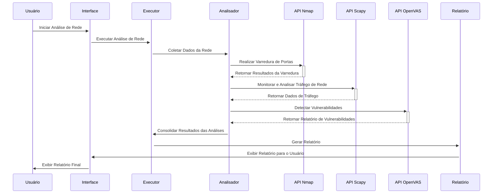
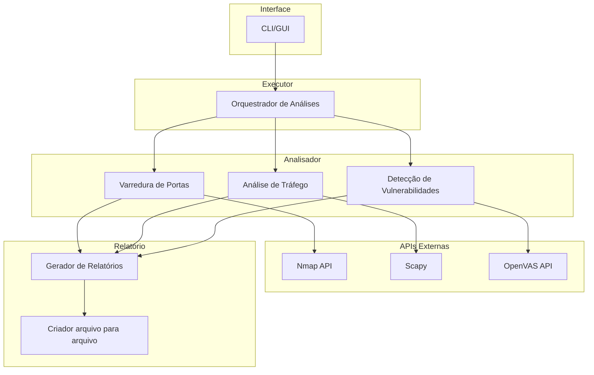

# Projeto-Final

## Introdução

Este projeto é uma ferramenta de análise de rede projetada para identificar vulnerabilidades e monitorar o tráfego de dados de forma automatizada. Usando APIs como Nmap, Scapy, e OpenVAS, a ferramenta realiza varreduras detalhadas na rede, analisa pacotes de dados e verifica a presença de falhas de segurança conhecidas. O objetivo é fornecer um relatório compreensivo que ajude administradores de rede e profissionais de segurança a protegerem seus ambientes contra ameaças potenciais.

## Diagrama de sequencia

## Diagrama de arquitetura

## Links uteis

- [Notion](https://brief-growth-fd4.notion.site/Projeto-final-a06a5a5f64094094bab902bbca05a5ef?pvs=4)