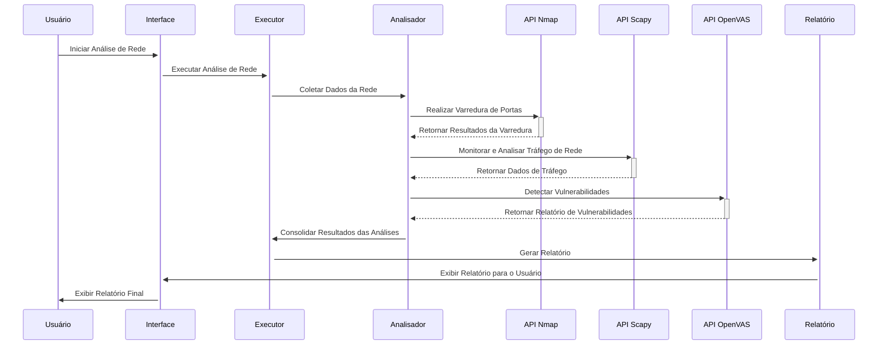
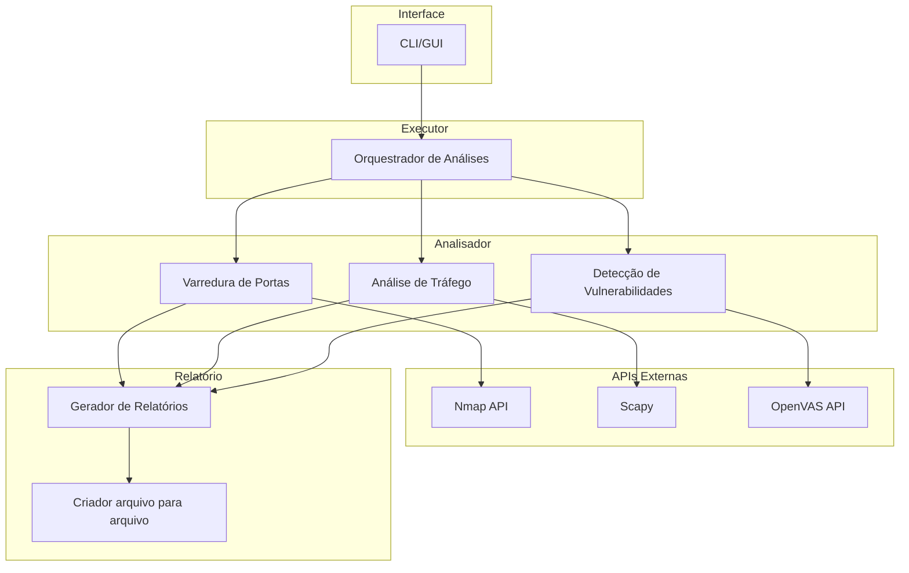

# Projeto-Final

## Introdução

Este projeto é uma ferramenta de análise de rede projetada para identificar vulnerabilidades e monitorar o tráfego de dados de forma automatizada. Usando APIs como Nmap, Scapy, e OpenVAS, a ferramenta realiza varreduras detalhadas na rede, analisa pacotes de dados e verifica a presença de falhas de segurança conhecidas. O objetivo é fornecer um relatório compreensivo que ajude administradores de rede e profissionais de segurança a protegerem seus ambientes contra ameaças potenciais.

## Diagrama de sequencia

## Diagrama de arquitetura

###
# PRD - Product Requirements Document

## Introdução & Objetivo

Este projeto visa desenvolver uma ferramenta de análise de rede automatizada para identificar vulnerabilidades e monitorar o tráfego de dados. A ferramenta utilizará APIs como Nmap, Scapy, e OpenVAS para realizar varreduras detalhadas na rede, analisar pacotes de dados e verificar a presença de falhas de segurança conhecidas. O sistema gerará relatórios abrangentes que ajudarão administradores de rede e profissionais de segurança a protegerem seus ambientes contra ameaças potenciais.

O objetivo inicial é fornecer uma solução eficaz para a identificação e mitigação de vulnerabilidades em redes, melhorando a segurança e a resiliência contra ataques cibernéticos.

## Por que Implementar Isto?

Implementar uma ferramenta automatizada de análise de rede oferece diversos benefícios:

- **Detecção Proativa de Ameaças**: Permite a identificação rápida e precisa de vulnerabilidades e anomalias no tráfego de dados, facilitando ações preventivas.
- **Automatização de Processos**: Reduz a necessidade de monitoramento manual constante, permitindo que equipes de segurança se concentrem em atividades mais estratégicas.
- **Eficiência Operacional**: Melhora a frequência e a consistência das análises de segurança, assegurando uma abordagem contínua e proativa para a proteção da rede.
- **Relatórios Abrangentes**: Fornece relatórios detalhados e compreensíveis sobre a segurança da rede, ajudando na tomada de decisões e na priorização de ações corretivas.

## Público-Alvo

|                       **Segmento** |                                                        **Descrição** |
| --- | --- |
| **Administradores de Rede** | Profissionais responsáveis pela gestão e manutenção das redes. Necessitam de uma solução para monitorar e proteger a infraestrutura contra ameaças. |
| **Profissionais de Segurança da Informação** | Especialistas focados em identificar e remediar vulnerabilidades para garantir a segurança dos sistemas e dados. |
| **Empresas de Médio e Grande Porte** | Organizações com redes complexas que buscam uma solução automatizada para melhorar a segurança cibernética. |

## Personas

### Pedro, Administrador de Rede

- **Ocupação**: Administrador de Rede

**Objetivos**: Manter a rede segura, minimizando interrupções e prevenindo ataques cibernéticos.

**Frustrações**: Processos manuais de monitoramento são demorados e ineficazes. Dificuldade em identificar vulnerabilidades sem uma ferramenta automatizada.

**Descrição**: Pedro tem 35 anos e 10 anos de experiência em administração de redes. Ele precisa de uma ferramenta eficiente que permita a detecção de vulnerabilidades e monitoramento com mínima intervenção manual.

### Yasmin, Especialista em Segurança da Informação

- **Ocupação**: Especialista em Segurança da Informação

**Objetivos**: Proteger dados e sistemas contra acessos não autorizados e ameaças emergentes.

**Frustrações**: Falta de relatórios detalhados e precisos que dificultam a justificativa para melhorias de segurança. Necessidade de ferramentas que proporcionem uma análise abrangente.

**Descrição**: Yasmin tem 29 anos e 7 anos de experiência em segurança da informação. Ela precisa de relatórios detalhados sobre vulnerabilidades e anomalias para justificar e implementar melhorias na segurança.

### Guilherme, Gerente de TI em uma Empresa de Médio Porte

- **Ocupação**: Ocupação: Gerente de TI

**Objetivos**: Garantir a segurança da infraestrutura de TI, mantendo custos operacionais controlados.

**Frustrações**: Dificuldade em encontrar soluções que automatizem a análise de segurança sem aumentar significativamente os custos. Necessidade de reduzir a carga de trabalho manual da equipe.

**Descrição**: Guilherme tem 42 anos e 15 anos de experiência em TI, gerenciando equipes e projetos. Ele busca uma solução que automatize a análise de segurança, reduzindo a carga de trabalho manual da equipe e mantendo a operação da rede.

---

# Requisitos Não Funcionais

Os requisitos não funcionais descrevem os critérios de desempenho, segurança, usabilidade e outras características que o sistema deve possuir. Eles garantem que o sistema funcione eficientemente sob diversas condições.

1. **NF1:** O sistema deve ser capaz de processar e analisar o tráfego de dados em tempo real com latência mínima para garantir a detecção rápida de ameaças. **P1**
2. **NF2:** A ferramenta deve garantir a segurança dos dados, utilizando criptografia para proteger as informações sensíveis durante a análise e geração de relatórios. **P1**
3. **NF3:** A interface do usuário deve ser intuitiva e fácil de usar, permitindo que administradores de rede e profissionais de segurança naveguem e interpretem os dados sem dificuldades técnicas. **P2**

**P1** = **Crítico | P2 = Importante | P3 = Bom ter**

### 📊 Métricas

Seja específico ao descrever os padrões ou métricas que devem ser atendidos. Inclua descrições detalhadas e, se possível, métricas mensuráveis.

| **Medida** | **Estado atual** | **Esperado** | **Resultados** |
| --- | --- | --- | --- |
| **Tempo de resposta** | Não aplicável | < 2 segundos |  |
| **Taxa de detecção de ameaças** | Não aplicável | > 95% |  |
| **Disponibilidade do sistema** | Não aplicável | 99,9% |  |
| **Nível de criptografia de dados** | Não aplicável | AES-256 |  |
| **Facilidade de uso (UX)** | Não aplicável | 80% de satisfação |  |

---

## Fora de Escopo

🚫 Liste todos os itens que estarão fora do escopo deste recurso do produto:

- Análise de tráfego criptografado de ponta a ponta sem acesso às chaves de criptografia.
- Implementação de correções automáticas para vulnerabilidades detectadas.
- Suporte a redes de dispositivos IoT não convencionais.
- Integração com sistemas de resposta a incidentes automáticos.

## Dependências

⚠️ Quais necessidades precisam ser supridas para que este produto/feature seja desenvolvido?

- APIs de terceiros: Nmap, Scapy, e OpenVAS para realizar varreduras e análises de rede.
- Infraestrutura de servidores para processar análises de rede em tempo real.
- Equipe de segurança para validar a eficácia da ferramenta e garantir a conformidade com as normas de segurança cibernética.
- Documentação e treinamento para usuários finais.

## Links uteis

- [Figma](https://www.figma.com/design/NCgJEHxTqGU1MJpCV0fXBp/Untitled?node-id=0-1&t=OdHpITJRzjUmeRDt-1) Protótipo de baixa fidelidade
- [Notion](https://brief-growth-fd4.notion.site/Projeto-final-a06a5a5f64094094bab902bbca05a5ef?pvs=4)
